#🤖 Amazon Alexa Reviews (NLP)

# Introduction

## Project Overview

This project aims to analyze Amazon Alexa reviews using Natural Language Processing (NLP) techniques. The primary objective is to perform sentiment analysis, classify reviews, and visualize data trends. We use a combination of Python libraries to preprocess the data, build models, and evaluate their performance.

## Features

- **Data Preprocessing:**
  - Text cleaning using regular expressions.
  - Stopwords removal and stemming using NLTK's PorterStemmer.
- **Sentiment Analysis:**
  - Classify reviews into positive or negative categories.
- **Modeling:**
  - Use machine learning models like Decision Tree and Random Forest for classification.
- **Evaluation:**
  - Confusion matrix, classification report, and cross-validation.
- **Visualization:**
  - Generate word clouds and plot data trends using Matplotlib and Seaborn.
  ## Technologies Used
- **Pandas**: Data manipulation and analysis.
- **NumPy**: Numerical operations.
- **Matplotlib & Seaborn**: Data visualization.
- **NLTK**: Natural language processing.
- **Scikit-learn**: Machine learning and model evaluation.
- **Regular Expressions (re)**: Text cleaning and preprocessing.

## Results

- **Model Accuracy**: [Include accuracy or any other metric]
- **Confusion Matrix**: [Include confusion matrix visualization]
- **WordCloud**: [Include word cloud visualization]

# EDA

- Exploring the Data and importing the libraries.

```py
- From full code refer to the Project file.
```

- importing the libraries:

```py
import pandas as pd
import numpy as np
import matplotlib.pyplot as plt
import seaborn as sns
import nltk
from nltk.stem.porter import PorterStemmer
nltk.download('stopwords')
from nltk.corpus import stopwords
STOPWORDS = set(stopwords.words('english'))

from sklearn.model_selection import train_test_split, cross_val_score, GridSearchCV, StratifiedKFold
from sklearn.metrics import confusion_matrix, classification_report, ConfusionMatrixDisplay
from sklearn.preprocessing import MinMaxScaler
from sklearn.ensemble import RandomForestClassifier
from sklearn.feature_extraction.text import CountVectorizer
from sklearn.tree import DecisionTreeClassifier
import pickle
import re
```

- Now importing the Data form Amazon alexa.csv file

```py
# import the Data and defining the dataset
df = pd.read_csv('../CSV/amazon_alexa.tsv', sep='\t', quoting=3)
print(f"Data shape : {df.shape}")
df.head()
```

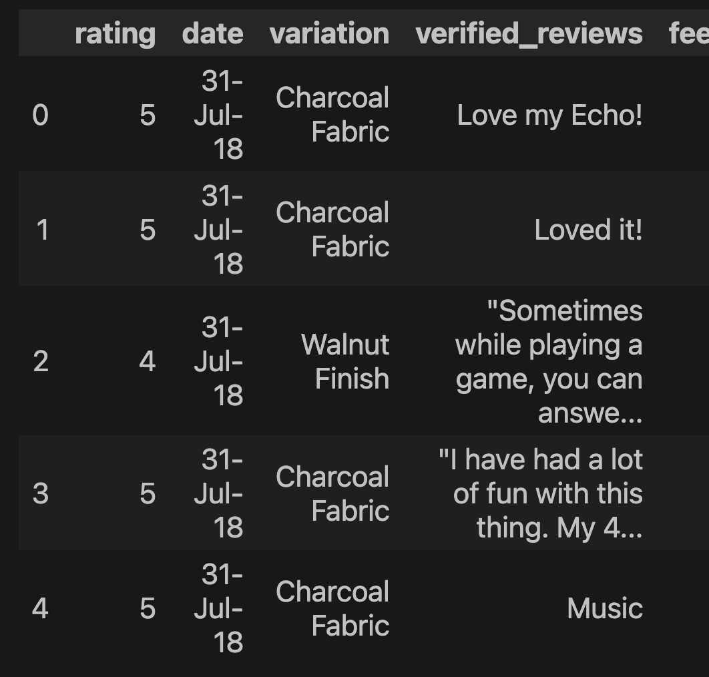

### Cleaning and removing Duplicates from the dataset.

```py
For more details go to the Project file .....
```

## Visulization:

- Deep diving into visualizing the dataset.

```py
plt.style.use('ggplot')
df['rating'].value_counts().plot(kind='bar', title='Ratings')
plt.ylabel('count')
plt.show()
```

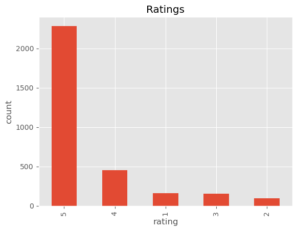

- Visualizing the Rating percentage by the length of data shape.

```py
fig = plt.figure(figsize=(7,7))
color = {'red', 'blue', 'green', 'orange', 'yellow'}
wp = {'linewidth': 1, 'edgecolor': 'black'}
tags = df['rating'].value_counts()/df.shape[0]
explode = (0.1,0.1,0.1,0.1,0.1)
tags.plot(kind='pie', autopct="%1.1f%%", shadow=True, startangle=90, wedgeprops=wp, explode=explode)
from io import BytesIO
graph = BytesIO()
fig.savefig(graph, format='png')
```

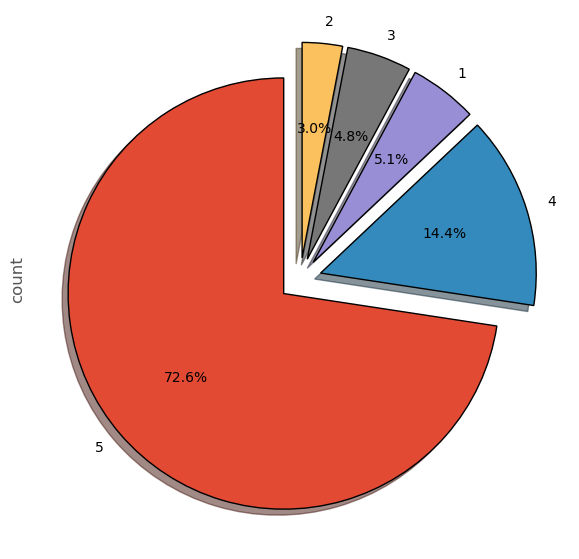

```py
df['feedback'].value_counts().plot(kind='bar', title='Feedbacks', ylabel='count')
plt.show()
```

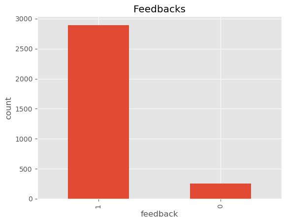

### Feedback column graph

```py
fig = plt.figure(figsize=(7,7))
colors = {'red', 'blue'}
wp = {'linewidth': 1, 'edgecolor': 'black'}
tags = df['feedback'].value_counts()/df.shape[0]
explode = (0.1,0.1)
tags.plot(kind='pie', autopct="%1.1f%%", shadow=True, startangle=90, wedgeprops= wp, explode = explode, colors=colors, ylabel='')

fig.savefig('graph', format='png')
plt.show()

```

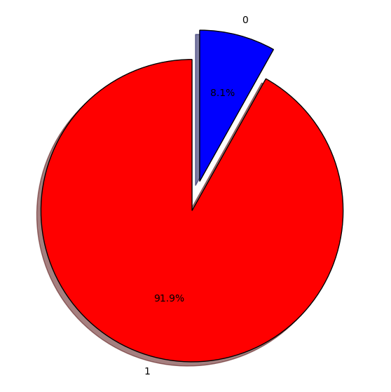

### Checking the Variation columns:

```py
df['variation'].value_counts().plot(kind='bar', ylabel='Count', title='Variation Count')
plt.show()
```

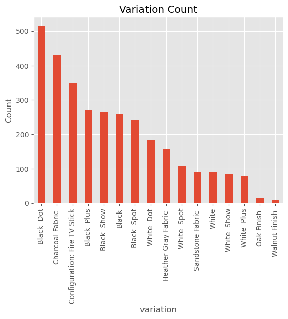

```py
df.groupby('variation')['rating'].mean().sort_values().plot(kind='bar', title='Mean variation distribution', ylabel='Mean ratings', figsize=(11,6))
plt.show()
```

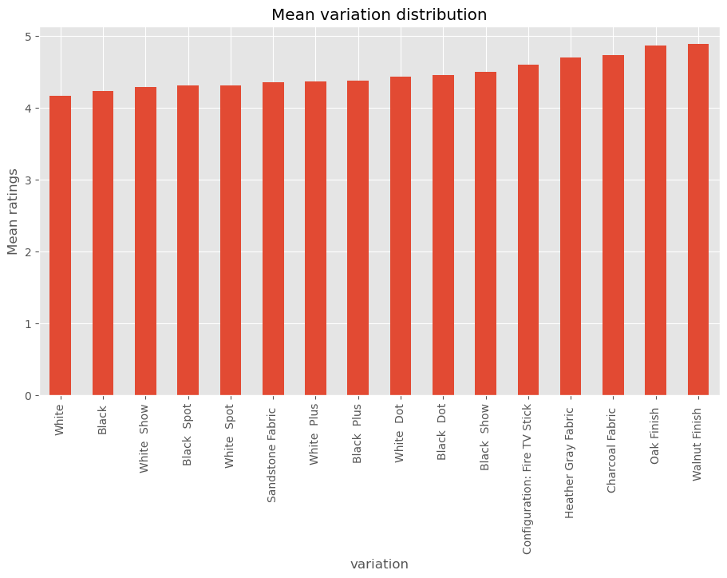

```py
df['length'].plot(kind='hist', bins=50, edgecolor='black', title='Length distribution', xlabel='length')
plt.show()
```

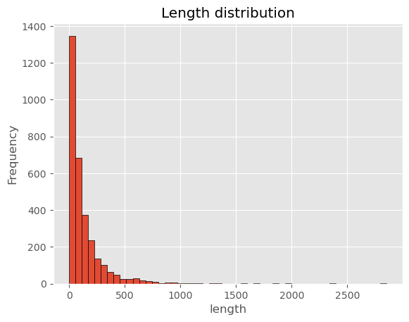

```py
df[df['feedback'] == 0]['length'].plot(kind='hist', bins=50, edgecolor='black', title='Negative Feedback Length Distribution', color='red', xlabel='length')
plt.show()
```

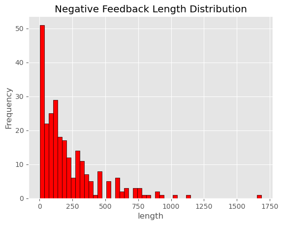

### Distribution of Positive feedback and negative feedback.

```py
df[df['feedback'] == 1]['length'].plot(kind='hist', bins=50,edgecolor='black', title='Positive Feedback distribution', color='green', xlabel='length')
plt.show()
```

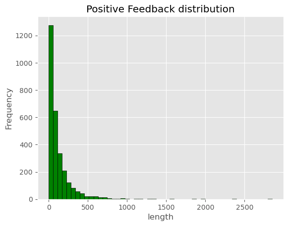

```py
df.groupby('length')['rating'].mean().plot(kind='hist', bins=20,edgecolor='black', color='blue', title='Review length', xlabel='Ratings')
plt.show()
```

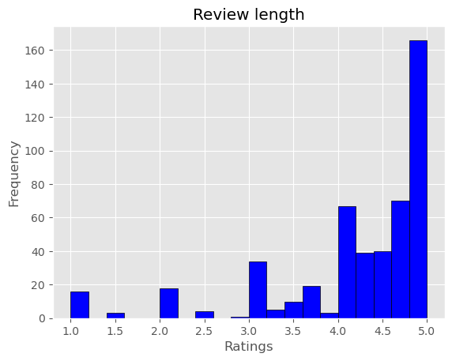

## Analysing all the Feedback from the users

```py

reviews = " ".join([review for review in df['verified_reviews']])


wc = WordCloud(background_color='white', max_words=50)


plt.figure(figsize=(10,10))
plt.imshow(wc.generate(reviews))
plt.title('Wordcloud for all reviews', fontsize=10)
plt.axis('off')
plt.show()
```

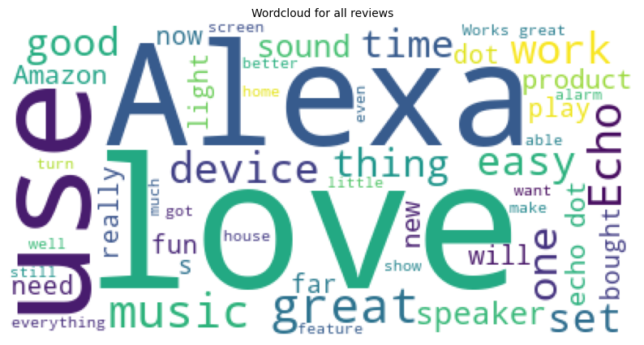

### Negative feedback:

```py
wc = WordCloud(background_color='white', max_words=50)

plt.figure(figsize=(10,10))
plt.imshow(wc.generate(unique_negative))
plt.tight_layout()
plt.title('Negative review cloud', fontsize=15)
plt.axis('off')
plt.show()
```

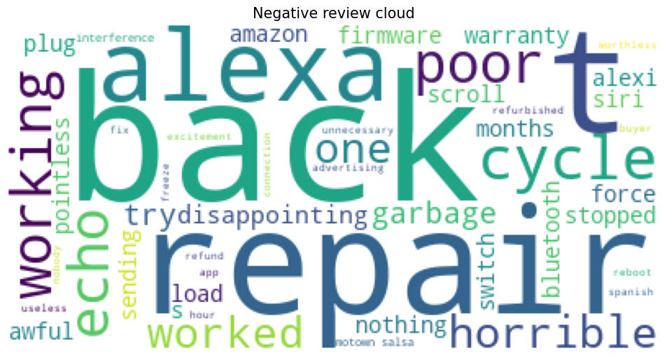

### Positive review:

```py
wc = WordCloud(background_color='white', max_words=50)

plt.figure(figsize=(10,10))
plt.imshow(wc.generate(unique_positive))
plt.tight_layout()
plt.title('Negative review cloud', fontsize=15)
plt.axis('off')
plt.show()
```

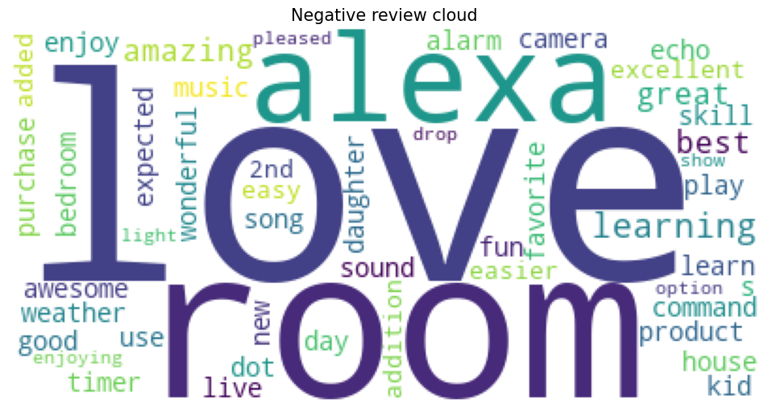

## Confusion Metric and Predictions:

### Randomforest model plot:

```py
cm_display = ConfusionMatrixDisplay(confusion_matrix=cm, display_labels=rn.classes_)
cm_display.plot()
plt.xlabel('Predicted')
plt.ylabel('True label')
plt.axis('off')
plt.show()
```


### Decision Tree Model Plot:

```py
cdt_display = ConfusionMatrixDisplay(confusion_matrix=cdt, display_labels=dt.classes_)
cdt_display.plot()
plt.axis('off')
plt.show()
```

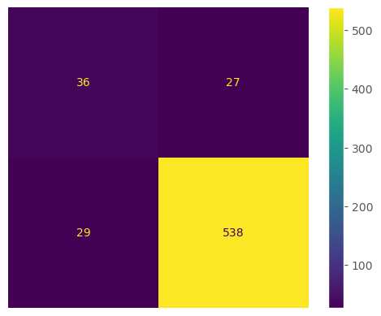

### Data insights:

- I have done 2 model one is Radomforest and another is decision tree model both has predicted really well.
- But as you can see Random forest model has run really better than Decision tree model. it's shows 97% accuracy.
- Random forest model is the best model than decision tree and well in prediction with less error.

## Conclusion:

This project successfully analyzed Amazon Alexa reviews using NLP techniques, providing valuable insights into customer sentiments. The data visualization highlighted key differences in word usage between positive and negative reviews, with positive feedback focusing on product satisfaction and ease of use, while negative reviews often mentioned problems and issues.

The Random Forest and Decision Tree models were employed to classify the reviews, with both models showing competitive performance. The Random Forest model, however, slightly outperformed the Decision Tree in terms of accuracy and precision, making it the preferred choice for this classification task.

Overall, the analysis demonstrates the power of NLP and machine learning in extracting meaningful patterns from textual data, offering a robust foundation for further refinement and application in real-world scenarios. Future work could involve exploring more advanced models or incorporating additional features to enhance classification accuracy.
